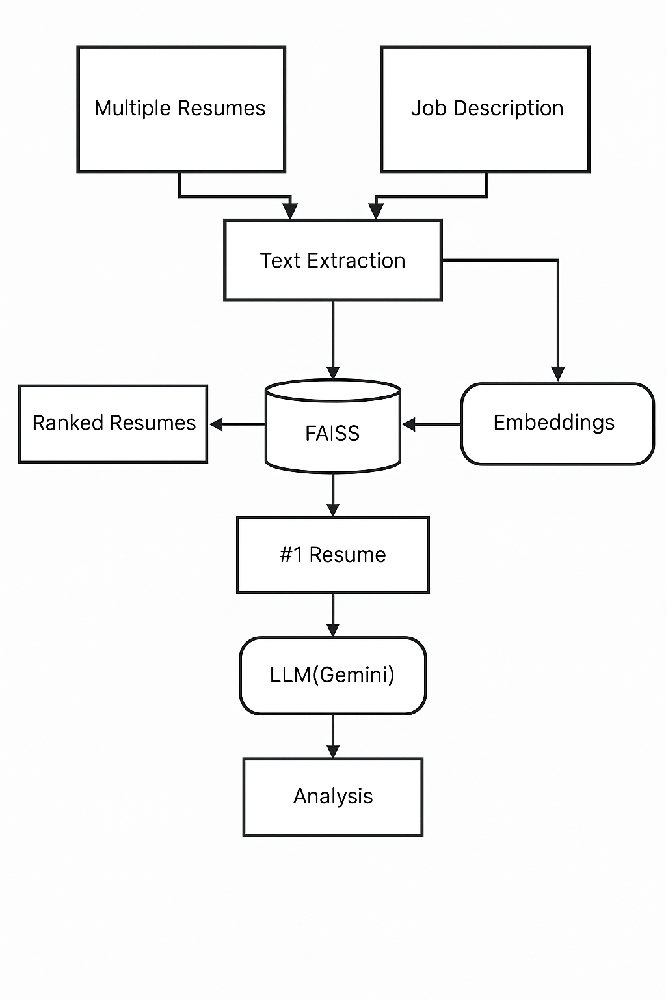

# Skill-Match-AI

Skill Match AI is a cutting-edge tool designed for HR teams to efficiently match multiple resumes against a job description, ranking and analyzing the best fits using state-of-the-art Retrieval‑Augmented Generation (RAG) techniques. It's accelerates hiring with accuracy and clarity — not only does it identify top resumes, it explains why the best‑matched candidate stands out.

## How to Run

### 1- Clone Respository
```bash
git clone https://github.com/Muhammad-Hashir14/Skill-Match-AI.git
```
### 2- Create Virtual Enviornment
```bash 
pip install virtualenv
virtualenv medibot
medibot\Scripts\activate  # For Windows
# OR
source medibot/bin/activate  # For macOS/Linux
```

### 3. Install Dependencies
```bash 
pip install -r requirements.txt
```

### 4. Create a .env File
```bash 
GEMINI_API_KEY="xxxxxxxxxxxxxxxxxxxxxxxxxxxxxxxxxxxxxx"
```

### 5. Run the Flask App
```bash
python app.py
```

## Architecuture
<p align="center">
  
</p>

### 💻 Tech Stack Used
- Python
- Flask
- Langchain
- Gemini (Google LLM)
- FAISS (Vector Database)

___
🙋‍♂️ Author:

- Developed by Muhammad Hashir

